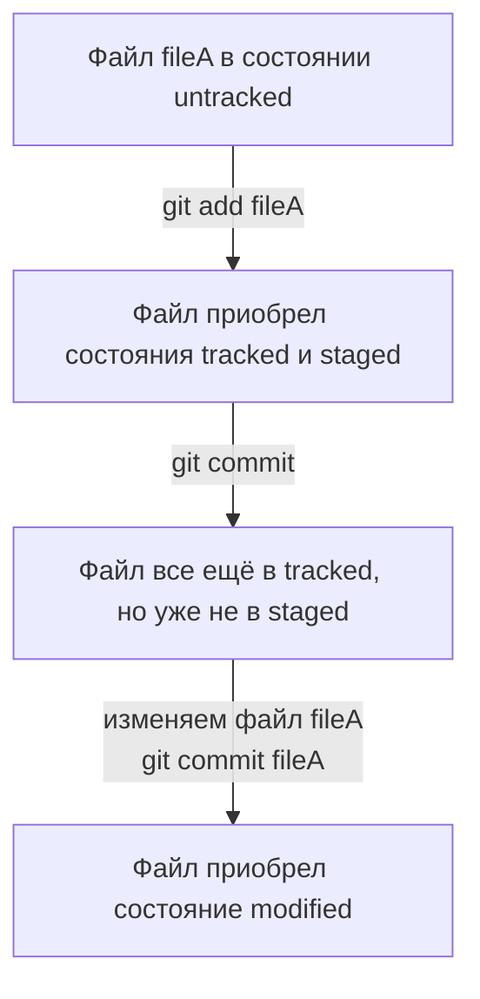

# Шпаргалка по git-у

## Установка Git

Windows - [Ссылка для установки git](https://git-scm.com/download/win) 

Linux - все стоит по-умолчанию

Проверить установку git можно с помощью команды
```shell
git -v
```

## Создание SSH-ключей для GitHub и других похожих сервисов

#### Генерация ключа
```shell
ssh-keygen -t ed25519 -C "Электронная почта, к которой привязан сервис"
```

#### Вывод в консоль публичного ключа
```shell
cat ~/.ssh/id_ed25519.pub
```

## Настройка пользователя git

```shell
git config --global user.name "Имя пользователя"
git config --global user.email "Почта"
```

## Создание репозитория

```shell
mkdir "Папка с проектом"
cd "Папка с проектом"
git init
git remote add origin "Ссылка на репозиторий"
```

## Создание коммитов

#### Добавление всех файлов из корневого каталога и его подкаталогов
```shell
git add --all
```

#### Создание коммита
```shell
git commit -m "Содержание коммита"
```

Если под windows при создании коммита забыть добавить флаг -m и текст с содержанием коммита, то откроется ~~vim~~ и вы от туда
<b style="font-size: large;">НЕ ВЫБЕРЕТЕСЬ НИКОГДА</b> (esc, :w, :q)

## Толкание коммита на удаленный сервер

#### Первый раз
```shell
git push -u origin "Название главной ветки (обычно master или main)"
```
#### Все последующие
```shell
git push
```

## История коммитов

#### Можно вывести историю коммитов при помощи команды
```shell
git log
```

#### Можно вывести лог в виде графа
```shell
git log --graph
```

#### Можно сократить количество символов в коммитах до 72
```shell
git log --oneline
```

## Статусы git

#### Untracked
Мы не добавляли файл в git

#### Tracked
Мы его туда добавили

#### Modified
Мы добавили файл в git, он прибрел состояние tracked, и после мы его снова изменили

#### Staged
Мы добавили файл в список тех, которые будут закоммиченны



#### Просмотр статусов файлов
```shell
git status
```

## Просто полезные команды

#### Вывести все коммиты (в том числе, те которые были в ветках без названия) 
```shell
git reflog
```

#### Помогите!!!
```shell
git help
```
